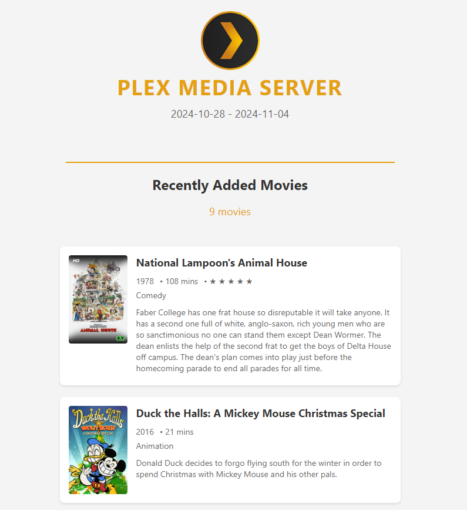

# Tautulli Custom Newsletter Template

This repository contains a custom HTML template for a "Recently Added" newsletter in Tautulli. This template provides a clean, customizable way to notify users of newly added content on your Plex Media Server. This template has been tested across multiple email clients on Desktop and Mobile, working in both Dark and Light mode. 

## Setup Instructions

1. **Download the Template**

   Download the `recently_added.html` file from this repository.

2. **Create a Custom Template Folder**

   - Place the `recently_added.html` file in a folder within your Tautulli directory or another location accessible to Tautulli.
   - **Important**: This file must be named `recently_added.html` to work correctly.

3. **Configure Tautulli to Use the Template**

   In Tautulli, go to **Settings** > **Notifications & Newsletters**:
   
   - Click the **Show Advanced** button.
   - Find the **Custom Newsletter Template Folder** option and set it to the full path of the folder you created above.

## Customization Options

The template includes comments to help you customize the newsletter's appearance to match your Plex server's branding:

- **Title**: Change the title to match your Plex Media Server name.
  - Look for the comment `<!-- Change to your Plex Media Server Name -->` in the HTML file.
  
- **Logo**: Update the logo to your server's logo or branding.
  - Look for the comment `<!-- Change to your Logo -->` in the HTML file.

- **Header Style**: Modify the `<h1>` style to match your desired branding.
  - Look for the comment `<!-- Change to your Plex Media Server Name -->` in the HTML file.

## Testing the Newsletter

After setting up and customizing the template, you can preview the newsletter to ensure it looks as expected.

1. Open your browser and navigate to the following URL:
http://<IP_address>:8181/newsletter_preview?newsletter_id=1
Replace `<IP_address>` with the IP address of your Tautulli instance.

This preview allows you to see how the newsletter will appear to your recipients before sending it out.

---

With this setup, your Tautulli instance will use the customized "Recently Added" template, keeping your users informed about new content on your Plex server in a personalized style!
